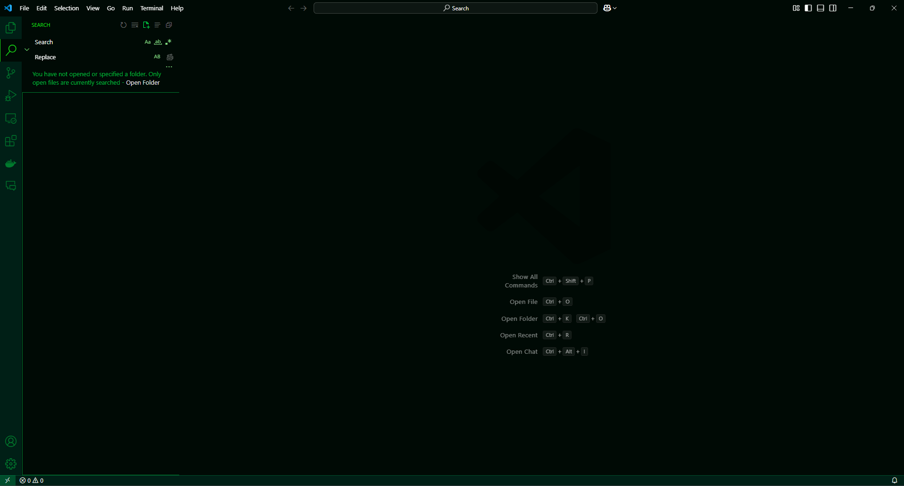
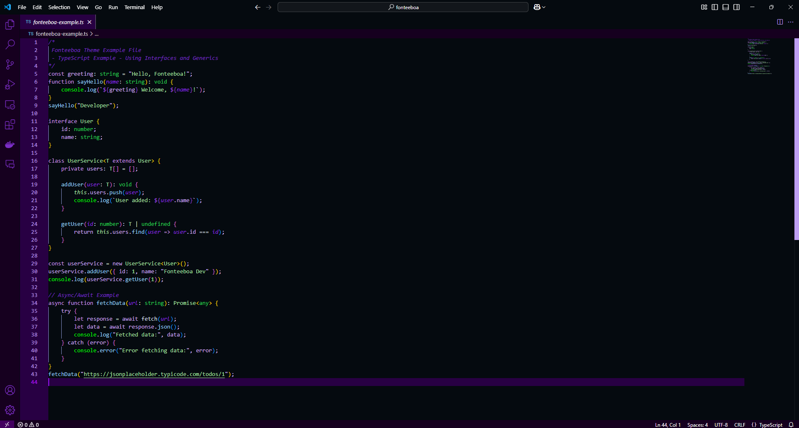

# 🎨 Fonteeboa Theme para Visual Studio Code

For the English version of this README, click [here](README_EN.md).

**Fonteeboa** é um tema moderno e estiloso para o **Visual Studio Code**, cuidadosamente projetado para refletir minhas preferências de cores pessoais e melhorar a legibilidade. Este tema está **diretamente ligado à minha marca e logotipo**, tornando a experiência única e personalizada.

Ele apresenta uma **paleta de cores vibrante e de alto contraste**, incluindo tons de **verde neon, azul ciano e vermelho profundo**, garantindo uma experiência visualmente agradável para os desenvolvedores. Seja programando em **JavaScript, Python, C++, Rust ou qualquer outra linguagem**, o Fonteeboa proporcionará uma aparência **consistente e imersiva** em todo o seu ambiente de desenvolvimento.

---

## 🚀 Por que escolher o Fonteeboa?

- ✅ **Cores Personalizadas** – Inspiradas nas minhas cores favoritas para uso diário.
- ✅ **Design Único** – Diretamente ligado à minha **marca e logotipo**.
- ✅ **Melhor Legibilidade** – Alto contraste para maior foco.
- ✅ **Suporte a Multiplas Linguagens** – Otimizado para JavaScript, Python, Rust, C++, Java e mais.
- ✅ **Interface Consistente** – Cores cuidadosamente selecionadas para toda a interface do VS Code.
- ✅ **Modo Escuro** – Projetado para longas sessões de codificação com mínimo cansaço visual.

---

## 📥 Instalação

### 1️⃣ **Instalar via Visual Studio Code Marketplace**
Se você usa **VS Code**, instale o tema executando:
```sh
ext install your-publisher.fonteeboa
```
Ou pesquise por "Fonteeboa" no Marketplace de Extensões.


### 2️⃣ Instalação Manual

Clone este repositório:
```sh
git clone https://github.com/fonteeboa/vscode-theme-fonteeboa.git
cd fonteeboa-theme
```

Instale a extensão:
```sh
code --install-extension fonteeboa.vsix
```

## 🎨 Visualização do Tema




## ⚙️ Como Usar
Abra a Command Palette `(Ctrl + Shift + P ou Cmd + Shift + P no macOS)`.

Pesquise por "Preferences: Color Theme".

Selecione `Fonteeboa` na lista.

## 🛠️ Personalização

Você pode ajustar ainda mais o tema modificando seu arquivo `settings.json` no VS Code:

```json
"workbench.colorTheme": "Fonteeboa",
"editor.fontFamily": "Fira Code, Consolas, Monaco, 'Courier New', monospace",
"editor.fontLigatures": true
```

## 📜 Licença
Este projeto está licenciado sob a Licença MIT. Consulte o arquivo LICENSE para mais detalhes.

