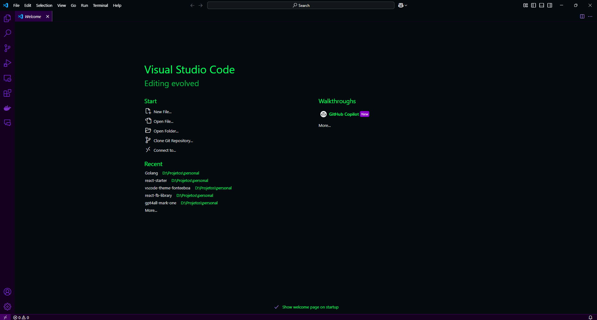

# 🎨 Fonteeboa Theme for Visual Studio Code

Para a versão em português deste README, clique [aqui](README.md).

**Fonteeboa** is a modern and stylish dark theme for **Visual Studio Code**, carefully designed to reflect my personal color preferences and enhance readability. This theme is **directly linked to my brand and logo**, making it a unique and custom experience.

It features a **vibrant and high-contrast color palette**, including shades of **neon green, cyan blue, and deep red**, ensuring a comfortable and visually pleasing experience for developers. Whether you're coding in **JavaScript, Python, C++, Rust, or any other language**, Fonteeboa will provide a **consistent and immersive** look across your entire development environment.

---

## 🚀 Why Fonteeboa?

- ✅ **Custom Colors** – Inspired by my favorite colors for daily use.
- ✅ **Unique Design** – Directly linked to my personal **brand and logo**.
- ✅ **Enhanced Readability** – High contrast for better focus.
- ✅ **Multi-Language Support** – Optimized for JavaScript, Python, Rust, C++, Java, and more.
- ✅ **Consistent UI** – Carefully selected colors for the entire VS Code interface.
- ✅ **Dark Mode** – Designed for long coding sessions with minimal eye strain.

---

## 📥 Installation

### 1️⃣ **Install from Visual Studio Code Marketplace**
If you are using **VS Code**, install the theme by running:
```sh
ext install your-publisher.fonteeboa
```
Or, search for "Fonteeboa" in the Extensions Marketplace.


### 2️⃣ Manual Installation

Clone this repository:
```sh
git clone https://github.com/fonteeboa/vscode-theme-fonteeboa.git
cd fonteeboa-theme
```

Install the extension:
```sh
code --install-extension fonteeboa.vsix
```

## 🎨 Theme Preview




## ⚙️ How to Use
Open Command Palette `(Ctrl + Shift + P or Cmd + Shift + P on macOS)`.

Search for "Preferences: Color Theme".

Select `Fonteeboa` from the list.
## 🛠️ Customization

You can further tweak the theme by modifying your settings.json file in VS 
Code:

```json
"workbench.colorTheme": "Fonteeboa",
"editor.fontFamily": "Fira Code, Consolas, Monaco, 'Courier New', monospace",
"editor.fontLigatures": true
```

## 📜 License
This project is licensed under the MIT License. See the LICENSE file for details.
